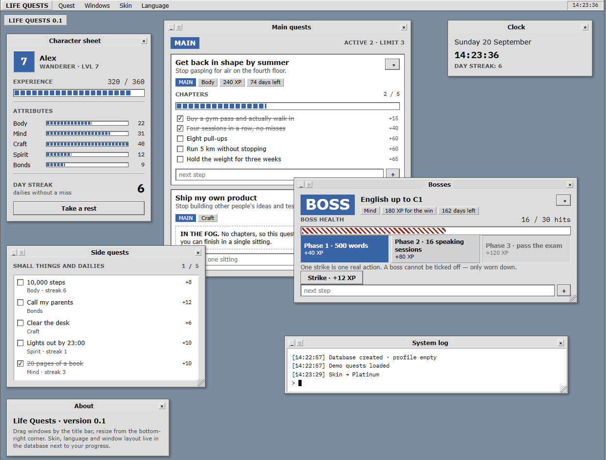

# Life Quests

Goals as quests. Main quests split into steps, side quests that repeat,
bosses with a health bar, experience and levels — in the interface of a
nineties operating system, where you drag the windows around.



No dependencies: Python standard library on the server, plain ES modules in
the browser. Nothing to install, nothing to build.

## Run

```bash
python run.py                        # http://127.0.0.1:8000
python run.py --demo                 # load demo quests first
python run.py --demo --demo-lang en  # demo in English
```

Python 3.11+. The database is created on first run next to `run.py` and
starts empty.

## Settings

Read from the environment; the code only holds defaults.

| Variable            | Default            | Sets                     |
| ------------------- | ------------------ | ------------------------ |
| `LIFE_QUESTS_DB`    | `./life_quests.db` | database file            |
| `LIFE_QUESTS_HOST`  | `127.0.0.1`        | address                  |
| `LIFE_QUESTS_PORT`  | `8000`             | port                     |
| `LIFE_QUESTS_HERO`  | `Герой`            | name in a fresh profile  |

## Tests

```bash
python -m unittest discover -s tests -t .   # 120 tests: server
node --test tests/test_layout.mjs           # 15 tests: window layout
```

Experience maths, actions against the database, a live server on a free port,
and the window arrangement from a laptop up to an ultrawide monitor. Both
runners are built in — nothing to install.

## How it works

```
run.py         entry point
schema.sql     six tables
app/xp.py      experience: thresholds, levels, ranks
app/api.py     actions and state assembly
app/server.py  HTTP: static files plus JSON API
static/        index.html, css/, js/
tests/         unittest, plus node --test for the layout
```

The server does the counting. The browser sends an intent ("tick this
chapter"), gets the whole new state back and draws it — there is no second
source of truth.

The level is never stored. It is derived from total experience, so unticking
a chapter returns exactly the state that came before it.

The database holds no human sentences either. Log lines and notifications are
stored as codes with parameters, and the wording lives in `static/js/i18n.js`.
That is what lets a language switch rewrite the whole journal after the fact.

### API

| Request                          | Does                              |
| -------------------------------- | --------------------------------- |
| `GET  /api/state`                | the whole state                   |
| `POST /api/quests`               | create a quest                    |
| `POST /api/quests/{id}/chapters` | add a step, a substep or a boss phase |
| `POST /api/quests/{id}/toggle`   | tick a side quest                 |
| `POST /api/quests/{id}/hit`      | strike a boss                     |
| `POST /api/quests/{id}/update`   | edit a quest                      |
| `POST /api/quests/{id}/delete`   | delete a quest                    |
| `POST /api/chapters/{id}/toggle` | tick a step                       |
| `POST /api/chapters/{id}/delete` | delete a step with its substeps   |
| `POST /api/profile`              | name, skin, language, rest, notepad, layout |

Writes answer with `{ "state": …, "flash": [ … ] }`. Errors come back as
`{ "error": "text" }` with 400, 404 or 409.

## The rules

- **Fog.** A main quest with no steps earns nothing and is drawn dashed.
  Goals get abandoned because the first move is unclear, not because people
  are lazy.
- **Steps nest one level.** A step can hold substeps, and then it is no longer
  yours to tick: it closes itself once every substep is done, and pays its own
  experience then. Otherwise you could claim a step whose work is unfinished.
- **A boss is a run of strikes.** A hard goal has health; one strike is one
  real action, and no checkbox ends it.
- **Rest.** A pause without punishment: the streak freezes, nothing burns
  down. Punishing a sick week drives people away for good.
- **A repeat is a rhythm, not a checkbox.** A side quest can come back every
  day, every week, every month, or every N of those. It reopens on its own
  when the period ends; the streak survives a period you closed and resets on
  one you skipped.
- **Five attributes.** The level speaks of volume, the bars of balance.
- **Experience is computed.** A main quest pays the sum of its chapters plus
  a quarter for closing it — never a number picked by hand.

## Interface

Two skins: **Windows 98** and **Platinum** (Mac OS 8). A skin only swaps CSS
variables — colours, bevels, title bar, font — so a third one costs a block
in `static/css/tokens.css`.

Two languages, Russian and English, switched from the menu and stored with
your progress.

Windows drag by the title bar and resize from the bottom-right corner. Until
you move them by hand, the arrangement is recomputed for the screen: two
columns on a laptop, three on a normal monitor, four past 1800 pixels, so an
ultrawide screen gets wider windows instead of a small desk in the middle.
Below 760 pixels the desktop stacks and dragging turns off.

There is a notepad too — one free sheet that saves itself.

## Licence

MIT — see [LICENSE](LICENSE).
